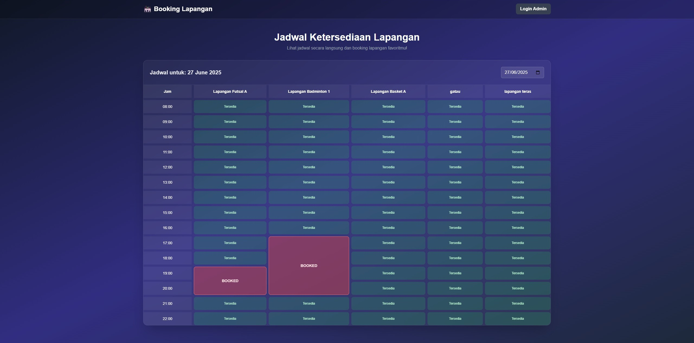
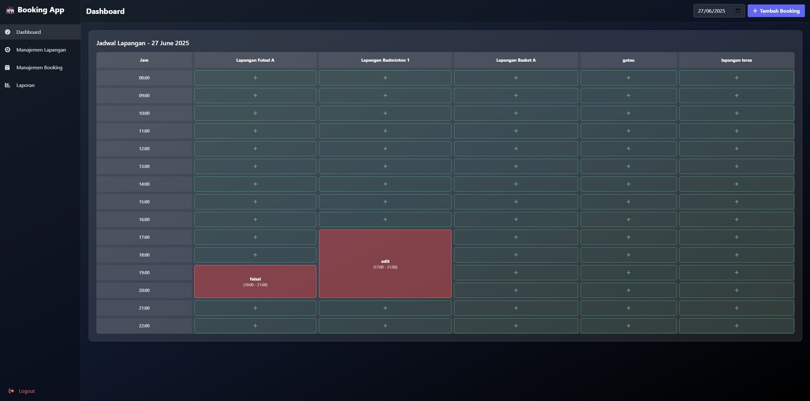
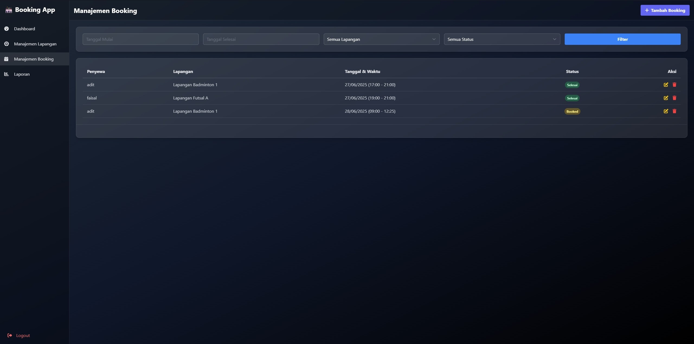

# Sistem Manajemen Booking Lapangan

Sebuah aplikasi web yang dibangun dengan Laravel untuk manajemen jadwal dan booking lapangan. Aplikasi ini dirancang dengan arsitektur modern menggunakan CSS Grid untuk menyajikan jadwal yang dinamis, fleksibel, dan responsif.





---

## ✨ Fitur & Keunggulan Utama

-   **Layout Jadwal Berbasis CSS Grid**: Arsitektur tampilan telah sepenuhnya beralih dari struktur tabel konvensional ke CSS Grid. Hal ini menjadikan layout lebih ringan, fleksibel, dan mudah untuk dikembangkan lebih lanjut.

-   **Konsistensi Antarmuka**: Sistem layout Grid yang sama diterapkan di halaman Dashboard dan halaman utama, menciptakan pengalaman pengguna yang seragam, profesional, dan intuitif.

-   **Penempatan Booking Dinamis**: Blok booking secara cerdas menyesuaikan tingginya sesuai durasi. Pemesanan untuk 3 jam akan otomatis membentang sepanjang tiga slot waktu secara vertikal, memberikan representasi visual yang akurat.

-   **Desain Visual yang Jelas dan Terstruktur**:
    -   Penggunaan `gap` antar elemen grid memberikan ruang visual yang cukup, sehingga jadwal tidak terlihat padat dan nyaman di mata.
    -   Garis pemisah horizontal halus mempertegas setiap slot waktu, meningkatkan keterbacaan jadwal secara keseluruhan.

-   **Indikator Status Slot yang Informatif**:
    -   Slot yang telah dipesan ditandai dengan warna merah yang kontras agar mudah diidentifikasi.
    -   Slot yang tersedia menggunakan warna hijau yang menenangkan, dilengkapi efek `hover` sebagai penanda interaktivitas.

-   **Navigasi Tanggal yang Efisien**: Pengguna dapat memilih tanggal melalui *date picker*, dan jadwal akan diperbarui secara otomatis tanpa perlu memuat ulang halaman atau menekan tombol submit.

-   **Antarmuka Modern dan Fungsional**: Dibangun seluruhnya dengan TailwindCSS, aplikasi ini menyajikan tema gelap yang modern. Navigasi utama juga dibuat agar tetap terlihat (*sticky*) saat halaman digulir untuk aksesibilitas yang lebih baik.

---

## 🏗️ Arsitektur & Alur Data

Untuk menampilkan jadwal yang dinamis, aplikasi ini menggunakan alur data yang terstruktur dari backend ke frontend.

### Bagian Backend (Controller)

Logika utama terjadi di dalam Controller sebelum data dikirim ke tampilan.

1.  **Menerima Permintaan**: Controller menerima permintaan HTTP, termasuk parameter tanggal yang dipilih oleh pengguna.

2.  **Mengambil Data Mentah**:
    -   Mengambil semua data **lapangan** dari database.
    -   Mengambil data **booking** yang relevan, spesifik untuk tanggal yang dipilih.
    -   Mempersiapkan daftar **slot waktu** (misalnya, dari jam 08:00 hingga 22:00).

3.  **Memproses & Membangun "Booking Matrix"**: Ini adalah langkah kunci. Daripada mengirim data mentah, Controller memprosesnya menjadi sebuah struktur data yang siap pakai bernama `$bookingMatrix`.
    -   **Tujuan**: Membuat sebuah array dua dimensi (matriks) yang memetakan setiap slot waktu untuk setiap lapangan (`$bookingMatrix[waktu][id_lapangan]`).
    -   **Proses**:
        a. Matriks diinisialisasi dengan status "Tersedia" untuk semua sel.
        b. Aplikasi kemudian melakukan iterasi pada data booking yang sebenarnya.
        c. Setiap booking ditempatkan pada "koordinat" yang benar di dalam matriks berdasarkan jam mulai dan ID lapangan.
        d. Durasi setiap booking dihitung (misal: 2 jam) dan disimpan bersama data booking di dalam matriks.

4.  **Mengirim Data Matang ke View**: Controller mengirimkan data yang sudah matang dan terstruktur (`$lapangans`, `$timeSlots`, dan `$bookingMatrix`) ke Blade view.

### Bagian Frontend (Blade View)

Tampilan (view) kini memiliki tugas yang lebih sederhana karena data yang diterima sudah siap untuk dirender.

-   **Render Grid**: View melakukan iterasi (looping) untuk membuat struktur grid. Loop pertama untuk baris (`$timeSlots`) dan loop kedua untuk kolom (`$lapangans`).
-   **Membaca Matriks**: Untuk setiap sel grid (persimpangan antara waktu dan lapangan), view akan memeriksa statusnya di dalam `$bookingMatrix`.
-   **Render Kondisional**:
    -   Jika data booking pada sel tersebut ada, view akan merender blok "Booked" dengan informasi penyewa.
    -   Durasi yang tersimpan dalam matriks digunakan untuk menerapkan class `row-span-[{{ $durasi }}]`, membuat blok tersebut membentang ke bawah sesuai durasi booking.
    -   Jika data booking tidak ada, view akan merender blok "Tersedia".

Dengan pendekatan ini, logika bisnis yang kompleks terpusat di backend, sementara frontend fokus pada presentasi data, membuat kode lebih bersih dan mudah dikelola.

---

## 🛠️ Teknologi yang Digunakan

-   **Backend**: PHP 8.1+, Laravel 10+
-   **Frontend**: Blade, Tailwind CSS, JavaScript
-   **Database**: MySQL
-   **Library Pendukung**:
    -   `Carbon`: Untuk manipulasi tanggal dan waktu.
    -   `Font Awesome`: Untuk ikonografi.

---

## 🚀 Instalasi & Setup

Berikut adalah langkah-langkah untuk menjalankan proyek ini di lingkungan lokal:

1.  **Clone repository ini:**
    ```bash
    git clone https://github.com/Zivalez/sistem-booking-lapangan.git
    cd sistem-booking-lapangan
    ```

2.  **Install dependency PHP via Composer:**
    ```bash
    composer install
    ```

3.  **Setup file environment & application key:**
    ```bash
    cp .env.example .env
    php artisan key:generate
    ```

4.  **Konfigurasi koneksi database pada file `.env`**.

5.  **Jalankan migrasi dan seeder database:**
    ```bash
    php artisan migrate --seed
    ```

6.  **Install dependency Node.js dan compile aset:**
    ```bash
    npm install
    npm run dev
    ```

7.  **Jalankan server development:**
    ```bash
    php artisan serve
    ```
    Aplikasi akan berjalan di `http://127.0.0.1:8000`.

---

## 🏗️ Struktur & Implementasi Kunci

Logika utama untuk render jadwal interaktif berbasis Grid berada di file view Blade yang relevan (misalnya, `dashboard.blade.php`).

-   **Arsitektur Layout**: Menggunakan sebuah `<div>` utama sebagai **Grid Container** untuk menggantikan `<table>`.
-   **Definisi Kolom & Baris**: Grid didefinisikan dengan kolom untuk label waktu dan untuk setiap lapangan, serta baris untuk setiap slot waktu.
-   **Penempatan Item Grid**: Blok booking diposisikan pada kolom dan baris yang sesuai. Durasi booking ditangani secara visual menggunakan class utility TailwindCSS seperti `row-span-[{{ $durasi }}]`, yang membuatnya membentang secara vertikal.
-   **Styling**: Seluruh aspek visual (termasuk `gap`, `border`, warna, dan `padding`) dikontrol oleh class utility dari TailwindCSS untuk konsistensi dan kemudahan maintenance.

